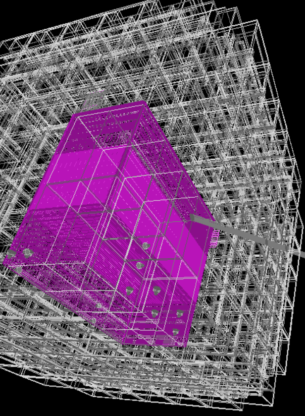

# Particle-Matter Interaction Simulations with Geant4

## Overview

This Geant4 simulation project, developed at LAPP, is designed to study low-energy backgrounds in underground liquid argon detectors. 
The geometry of ProtoDUNE-VD and pulsed neutron source is simulated for this purpose.



---

## Getting Started

### Recommended Environment

- It is highly recommended to use this project on a cluster (e.g., lxplus, MUST, CC).
- If you wish to run the simulation locally, you must first install the Geant4 software on your system.

### Setting Up in CC IN2P3

To set up the required environment in the CC IN2P3 cluster:

1. Create a `setup_g4.sh` file with the following content:

   ```bash
	module add Modelisation/geant4/11.4.0
	module add Production/cmake/3.29.2
	module load Analysis/root/6.30.06
	module add Compilers/gcc/13.2.0
	export G4NEUTRONHPDATA=/sps/lbno/lmanzani/ENDF-VIII.0
	export G4NUDEXLIBDATA=/sps/lbno/lmanzani/G4NUDEXLIB1.0
   ```
The G4NEUTRONHPDATA and G4NUDEXLIBDATA allows to have precission simulations based on data for neutron cross sections interactions as well as for gamma cascades from neutron capture.
You need to download these files from geant4 repository.

2. At the start of each session, run:

   ```bash
   source setup_g4.sh
   ```


### Setting Up in LXPLUS

To set up the environment in LXPLUS:

1. Create a `setup_geant4.sh` file with the following content:

   ```bash
	# Load GCC 15
	source /cvmfs/sft.cern.ch/lcg/contrib/gcc/15/x86_64-el9/setup.sh

	# Load LCG stack containing CLHEP
	source /cvmfs/sft.cern.ch/lcg/views/LCG_109/x86_64-el9-gcc15-opt/setup.sh

	# Load Geant4 CMake environment
	source /cvmfs/geant4.cern.ch/geant4/11.4/x86_64-el9-gcc15-optdeb-MT/CMake-setup.sh

	#NUDEX data
	export G4NEUTRONHPDATA=/afs/cern.ch/work/l/lmanzani/ENDF-VIII.0
	export G4NUDEXLIBDATA=/afs/cern.ch/work/l/lmanzani/G4NUDEXLIB1.0

   ```
The G4NEUTRONHPDATA and G4NUDEXLIBDATA allows to have precission simulations based on data for neutron cross sections interactions as well as for gamma cascades from neutron capture.
You need to download these files from geant4 repository.

2. At the start of each session, run:

   ```bash
   source setup_geant4.sh
   ```

---

## Simulation Geometry

### Key Dimensions (in cm)

- **Active LAr TPC volume:** Ends at x = ±343.0, y = ±340.0, z = [0.0, 300.0]

### Placement of External Sources

To simulate neutrons from outside:

- Ensure your source coordinates are outside the cryostat.
- Example for x-coordinates: Choose values larger than 600 cm (adjust based on geometry).

---

## Installation

### Cloning the Repository

If this is your first time using the project, clone the repository:

```bash
git clone git@github.com:lmanzanillas/ULALAP.git
```

### Building the Software

1. Create and navigate to a `build` directory:

   ```bash
   mkdir build
   cd build
   ```

2. Run the following commands to configure and build the project:

   ```bash
   cmake ../ULALAP/ # Adjust the path if necessary
   make
   ```

3. To verify the installation, run:

   ```bash
   ./ULALAP
   ```

---

## Running the Simulation

### Interactive Mode

After running `./ULALAP`, you can view the geometry and run events interactively. Example:

```bash
/run/beamOn 1
```

### Batch Mode

For large-scale simulations, use a macro file (e.g., `test.mac`). Example:

```bash
./ULALAP -m test.mac
```

### Modifying `test.mac`

Several .mac files are provided and can be modified according to your case study

You can modify settings such as energy, particle type, and source geometry in the macro file. Example content:

```bash
#/ULALAP/det/setOutputDirectory /path/to/output/
#/ULALAP/det/setDetectorName MyDetector
#/ULALAP/det/setDetectorType 5
#/ULALAP/det/setShieldingMaterial water_borated
#/ULALAP/det/setShieldingThickness 100 cm
/process/had/particle_hp/use_photo_evaporation true
/process/had/particle_hp/do_not_adjust_final_state true
/process/had/particle_hp/skip_missing_isotopes true
/process/had/rdm/thresholdForVeryLongDecayTime 1.0e+60 year

# Source configuration
/ULALAP/gun/sourceType 9
/ULALAP/gun/position 10 20 30
/run/beamOn 100000
```

Uncomment and adjust the lines as needed to suit your simulation requirements.

---

## Additional Notes

- A Julia package has been created to read and analyze the geant4 output of this package: [DUNEatLapp.jl](https://github.com/MaelMartin17/DUNEatLapp.jl) 
- Ensure you are familiar with Geant4 macros and environment setup before running complex simulations.
- Check the output data format and directory settings to match your analysis pipeline.
- For support or contributions, refer to the repository documentation or contact the developers.

